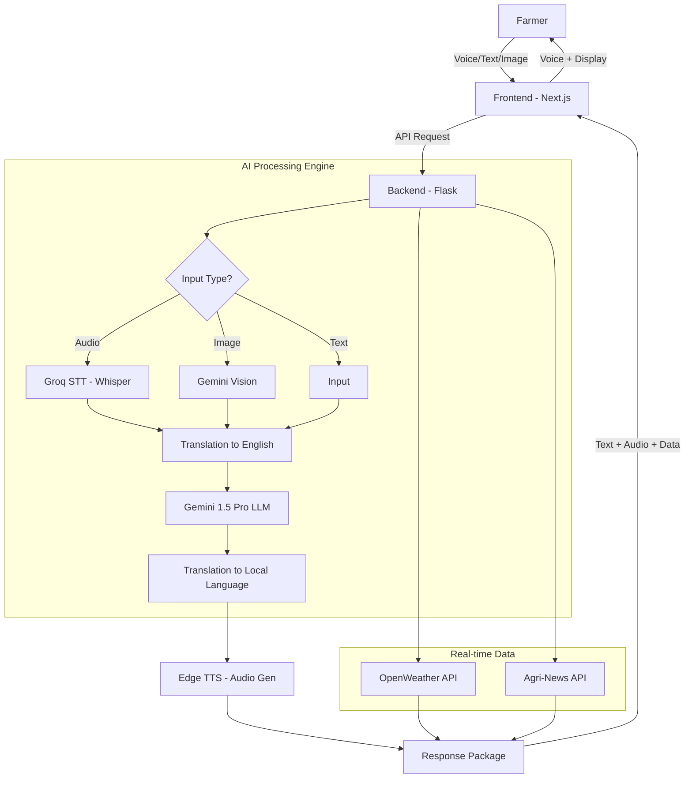

# 🌾 AgroSaathi: Your Advanced AI Agricultural Companion

**AgroSaathi** is a cutting-edge, multilingual AI assistant designed to empower farmers with real-time agricultural intelligence. By bridging the gap between advanced technology and traditional farming, AgroSaathi provides actionable insights through voice, text, and visual analysis in local Indian languages.

---

## 🌟 Key Features

- **🗣️ Multilingual Voice Interface**: Speak your queries in your local language (Hindi, Kannada, Tamil, Marathi, etc.) and receive voice responses. Powered by **Groq Whisper STT** and **Edge TTS**.
- **👁️ Visual Crop Analysis**: Upload images of your crops or soil to receive instant AI diagnosis for diseases, pests, and nutrient deficiencies using **Google Gemini Vision**.
- **🌤️ Hyper-local Weather**: Real-time weather forecasts and agricultural advisories tailored to your specific GPS location.
- **📰 Agricultural News**: Stay updated with the latest farming trends, government schemes, and market prices through a curated agri-news feed.
- **🗺️ Native Language Support**: Seamless translation between English and multiple Indian languages, ensuring technology is accessible to everyone.

---

## 🏗️ System Architecture & Workflow

AgroSaathi follows a sophisticated pipeline to ensure accurate and accessible responses:

1.  **Input Acquisition**: The farmer provides input via **Voice (Audio)**, **Text**, or **Image**.
2.  **Processing Pipeline**:
    *   **STT**: Audio is transcribed using the **Groq Whisper-v3** model.
    *   **Translation**: Input is translated to English for optimal AI processing.
    *   **AI Analysis**:
        *   **Text Queries**: Processed by **Gemini-1.5-Pro**.
        *   **Image Queries**: Analyzed by **Gemini Vision** to identify crop issues.
    *   **Contextualization**: The system integrates real-time weather and news data when relevant.
3.  **Output Generation**:
    *   **Translation**: The response is translated back to the user's native language.
    *   **TTS**: The native text is converted into high-quality audio using **Edge TTS**.
4.  **Delivery**: The farmer receives both a text display and a clear audio response.

---

## 📊 Flowchart



## 📁 Project Structure

```text
agroSaathi/
├── backend/                # Python Flask Backend
│   ├── api/                # API Routes (chat, weather, news)
│   ├── services/           # Core AI & External Services
│   │   ├── llm_service.py  # Gemini Integration
│   │   ├── stt_service.py  # Groq Whisper Integration
│   │   ├── tts_service.py  # Edge TTS Integration
│   │   └── weather_service.py
│   ├── uploads/            # Temporary storage for audio/images
│   └── app.py              # Backend Entry Point
├── src/                    # Next.js Frontend
│   ├── app/                # Main Pages & Layout
│   ├── components/         # Reusable UI Components
│   └── lib/                # Utility functions & Translations
├── public/                 # Static Assets
└── README.md               # You are here!
```

---

## 🛠️ Tech Stack

- **Frontend**: [Next.js](https://nextjs.org/) (React), [Tailwind CSS](https://tailwindcss.com/), [Lucide React](https://lucide.dev/)
- **Backend**: [Flask](https://flask.palletsprojects.com/) (Python)
- **AI Models**:
    *   **LLM & Vision**: [Google Gemini 1.5 Pro](https://ai.google.dev/)
    *   **Speech-to-Text**: [Groq Whisper-large-v3](https://groq.com/)
    *   **Text-to-Speech**: [Microsoft Edge TTS](https://github.com/rany2/edge-tts)
- **APIs**:
    *   **Weather**: [OpenWeatherMap](https://openweathermap.org/)
    *   **News**: [Agritube / NewsAPI](https://newsapi.org/)

---

## 🚀 Getting Started

### Prerequisites
- Node.js (v18+)
- Python (v3.9+)
- API Keys for: Gemini, Groq, OpenWeatherMap, and NewsAPI.

### Installation

1.  **Clone the Repository**
    ```bash
    git clone https://github.com/yourusername/agroSaathi.git
    cd agroSaathi
    ```

2.  **Backend Setup**
    ```bash
    cd backend
    python -m venv venv
    source venv/bin/activate  # On Windows: venv\Scripts\activate
    pip install -r requirements.txt
    ```

3.  **Frontend Setup**
    ```bash
    # From the root directory
    npm install
    ```

4.  **Environment Variables**
    Create a `.env` file in the root directory and add:
    ```env
    GEMINI_API_KEY="your_gemini_key"
    GROQ_API_KEY="your_groq_key"
    WEATHER_API_KEY="your_weather_key"
    AGRI_NEWS_API_KEY="your_news_key"
    ```

### Running the Application

1.  **Start Backend** (Port 5000):
    ```bash
    cd backend
    python app.py
    ```

2.  **Start Frontend** (Port 3000):
    ```bash
    # From the root directory
    npm run dev
    ```

Open [http://localhost:3000](http://localhost:3000) in your browser.

---

## 🎯 Innovation & Impact

AgroSaathi is more than just a chatbot; it's a lifeline for farmers:
- **Low Literacy Friendly**: Voice-first approach ensures accessibility for all.
- **Language Inclusivity**: Removes the English-language barrier in technology.
- **Expertise at Scale**: Brings world-class agricultural science to the most remote farms.
- **Data-Driven Decisions**: Empowers farmers with real-time weather and news to minimize risks.

---
Made with ❤️ for the farming community.
